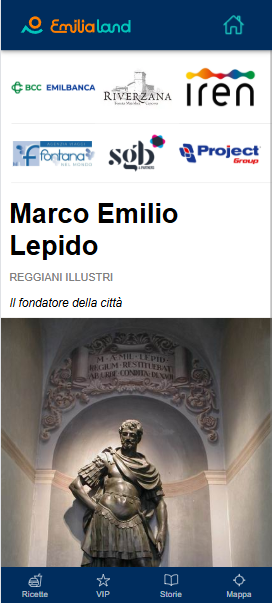
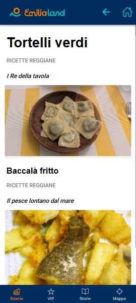
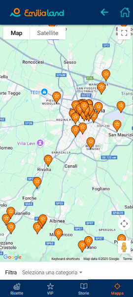

# Scoprire

Scoprire is a Progressive Mobile App developed with [Ionic](https://ionicframework.com/) and [Angular](https://angular.io/). 
The app allows users and visitors to discover attractions, services, and interesting places in the Emilia region.

## Main Features

- **Frontend:** Angular + Ionic (with Capacitor)
- **Languages:** HTML, TypeScript, SCSS
- **Compatibility:** Mobile-first, installable as a PWA
- **Key Functionality:**  
  - Browse categories, locations, and services
  - Interactive map
  - Search and filters
  - Detailed information on points of interest (POI)
  - Modern UI, intuitive navigation

## Project Structure

- `src/app`: Contains modules, pages, and main services of the app
- `package.json`, `angular.json`: Angular project configuration
- `ionic.config.json`, `capacitor.config.ts`: Integration with Ionic Capacitor for mobile/PWA features
- `scss/`: Custom styles

## Getting Started

bash
npm install
ionic serve

or

ng serve

## To build as PWA or for mobile

ionic build
ionic cap sync
ionic cap open android # or ios

## Backend connection

The app connects to an AWS serverless backend (see scoprireBackend).
Make sure to properly configure API endpoints in the Angular service lay

## Screenshots

